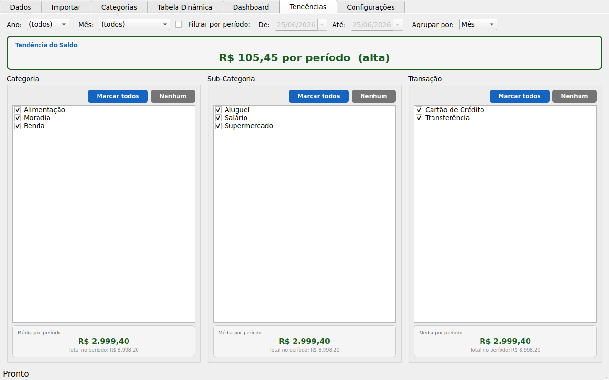
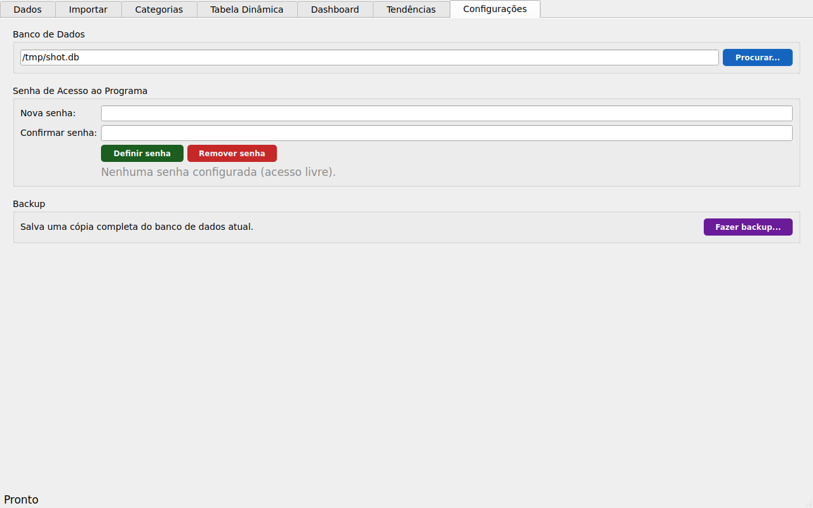

# Manual do Usuário — Tabela Dinâmica

### Seu controle financeiro pessoal, com o poder de uma Tabela Dinâmica do Excel

---

## Sumário

1. [O que é este programa e para quem ele serve](#1-o-que-é-este-programa-e-para-quem-ele-serve)
2. [Visão geral da tela principal](#2-visão-geral-da-tela-principal)
3. [Aba "Dados" — lançando suas receitas e despesas](#3-aba-dados--lançando-suas-receitas-e-despesas)
4. [Aba "Importar" — trazendo dados de uma planilha](#4-aba-importar--trazendo-dados-de-uma-planilha)
5. [Aba "Categorias" — cadastrando Categoria, Sub-Categoria e Transação](#5-aba-categorias--cadastrando-categoria-sub-categoria-e-transação)
6. [Aba "Tabela Dinâmica" — o coração do programa](#6-aba-tabela-dinâmica--o-coração-do-programa)
7. [Aba "Dashboard" — o resumo visual das suas finanças](#7-aba-dashboard--o-resumo-visual-das-suas-finanças)
8. [Aba "Tendências" — médias e tendência ao longo do tempo](#8-aba-tendências--médias-e-tendência-ao-longo-do-tempo)
9. [Aba "Configurações" — senha, banco de dados e backup](#9-aba-configurações--senha-banco-de-dados-e-backup)
10. [Exportando para Excel e CSV](#10-exportando-para-excel-e-csv)
11. [Onde ficam seus dados e como fazer backup](#11-onde-ficam-seus-dados-e-como-fazer-backup)
12. [Perguntas frequentes e dicas](#12-perguntas-frequentes-e-dicas)
13. [Glossário rápido](#13-glossário-rápido)

---

## 1. O que é este programa e para quem ele serve

O **Tabela Dinâmica** é um programa de controle financeiro pessoal (ou de pequenos negócios) que funciona como um "Excel especializado": você lança suas entradas e saídas de dinheiro, e o programa cruza esses dados de todas as formas possíveis — por categoria, por mês, por ano, por tipo de transação — automaticamente, sem você precisar escrever nenhuma fórmula.

Se você já usou uma **Tabela Dinâmica** (Pivot Table) no Excel, vai se sentir em casa. Se nunca usou, não se preocupe: este manual explica tudo do zero, com exemplos práticos.

### O que você consegue responder com o programa

- Quanto gastei em Alimentação no mês passado?
- Qual foi minha categoria de despesa mais cara em 2026?
- Minhas entradas estão maiores que minhas saídas este mês?
- Quais foram meus 5 maiores gastos do ano?
- Como minhas despesas de "Cartão de Crédito" evoluíram mês a mês?

Tudo isso sem precisar montar fórmulas — só escolher o que você quer ver em alguns menus.

### A estrutura dos seus dados

Cada lançamento (cada linha que você registra) tem estes campos:

| Campo | O que significa | Exemplo |
|---|---|---|
| **Data** | Data (e opcionalmente hora) do lançamento | `15/06/2026 10:30:00` |
| **Categoria** | O grupo principal do gasto/receita | `Alimentação`, `Moradia`, `Renda` |
| **Sub-Categoria** | Um detalhamento da categoria | `Supermercado`, `Aluguel`, `Salário` |
| **Transação** | Como o dinheiro entrou/saiu | `Cartão de Crédito`, `Débito`, `Transferência` |
| **Descrição** | Um texto livre para você lembrar do que se tratou | `Compras do mês`, `Conta de luz - junho` |
| **Valor** | O valor em reais. **Negativo = saída, Positivo = entrada** | `-350,90` ou `3500,00` |

> **Regra de ouro:** despesas (dinheiro saindo) sempre entram com **valor negativo**; receitas (dinheiro entrando) sempre com **valor positivo**. É essa regra que faz todo o resto do programa (cores, somas, Dashboard) funcionar corretamente.

---

## 2. Visão geral da tela principal

O programa é organizado em **7 abas**, no topo da janela:

| Aba | Para que serve |
|---|---|
| **Dados** | Cadastrar, editar, excluir e pesquisar seus lançamentos, um por um |
| **Importar** | Trazer uma grande quantidade de lançamentos de uma vez, a partir de uma planilha Excel/CSV |
| **Categorias** | Cadastrar as Categorias, Sub-Categorias e Transações que aparecem como sugestão na aba Dados |
| **Tabela Dinâmica** | Cruzar e analisar os dados em qualquer combinação (a parte mais poderosa) |
| **Dashboard** | Um painel visual de resumo, com cartões e mini-tabelas, para uma visão rápida |
| **Tendências** | Médias e tendência (subindo/caindo) de Categoria, Sub-Categoria, Transação e do Saldo, ao longo do tempo |
| **Configurações** | Senha de acesso ao programa, troca do banco de dados e backup |

Você pode alternar entre elas a qualquer momento — os dados são os mesmos, vistos de formas diferentes.

---

## 3. Aba "Dados" — lançando suas receitas e despesas

Esta é a aba onde a "matéria-prima" do programa é alimentada: cada lançamento financeiro individual.

A aba é dividida em três partes, de cima para baixo:

### 3.1 Formulário de registro (topo)

É aqui que você cadastra um novo lançamento ou edita um já existente.

**Campos do formulário:**

- **Data** — digite no formato `dd/mm/aaaa` (ex: `15/06/2026`) ou, se quiser registrar também o horário, `dd/mm/aaaa hh:mm:ss` (ex: `15/06/2026 10:30:00`). É o único campo obrigatório.
- **Categoria / Sub-Categoria / Transação** — são campos com sugestão automática (autocompletar): ao digitar, o programa mostra os valores que você já usou antes, para você manter um padrão (evitando, por exemplo, cadastrar "Alimentacao" numa linha e "Alimentação" em outra).
- **Descrição** — texto livre, opcional, para você lembrar do que se tratou aquele lançamento.
- **Valor** — o valor em reais. Lembre-se: **negativo para saídas, positivo para entradas**. Aceita tanto `350,90` quanto `350.90`.

**Os botões do formulário:**

| Botão | O que faz |
|---|---|
| **Salvar** | Grava o lançamento novo no banco de dados (ou atualiza, se você estiver editando um existente — nesse caso o botão muda o texto para "Atualizar") |
| **Limpar** | Limpa o formulário. Ao limpar, o programa já **pré-preenche Data, Categoria, Sub-Categoria e Transação com os mesmos valores do último lançamento salvo**, deixando só Descrição e Valor em branco — isso agiliza muito quando você está lançando vários gastos parecidos em sequência (ex: vários itens de supermercado no mesmo dia) |
| **Excluir Selecionado** | Exclui o(s) registro(s) atualmente selecionados na tabela abaixo (pede confirmação) |
| **Duplicar Selecionado** | Copia **todos** os campos (inclusive Descrição e Valor) do registro selecionado na tabela para o formulário, como se fosse um novo lançamento. Útil quando você tem um gasto idêntico a um já cadastrado (ex: o mesmo aluguel todo mês) — você só ajusta a data e salva |
| **Aplicar a Selecionados** | Aparece quando você seleciona **mais de um** registro na tabela. Permite alterar um ou mais campos (ex: trocar a Categoria de vários lançamentos de uma vez) em lote |

> **Como editar um lançamento já existente?** Basta clicar nele na tabela abaixo — o formulário é preenchido automaticamente com os dados daquele registro e o botão muda para "Atualizar". Faça as alterações e clique em "Atualizar".

### 3.2 Filtros / Pesquisa

Logo abaixo do formulário, uma barra permite filtrar a lista de lançamentos exibida na tabela:

- **Data** — filtra por texto contido na data (ex: digitar `06/2026` mostra tudo de junho de 2026)
- **Categoria / Sub-Categoria / Transação / Descrição** — filtros de texto livre (não precisa ser exato, basta conter o texto digitado)
- **Ano** e **Mês** — combos para filtrar por período
- **✕ Limpar** — remove todos os filtros de uma vez

Os filtros funcionam **em conjunto** (E lógico): se você preencher Categoria = "Alimentação" e Ano = "2026", só aparecem lançamentos que atendem às duas condições.

### 3.3 Tabela de lançamentos

Mostra todos os lançamentos que passam pelo filtro atual. Você pode:

- **Clicar em uma coluna do cabeçalho** para ordenar por ela (clique novamente para inverter a ordem)
- **Arrastar a borda de uma coluna** para redimensioná-la — o programa lembra essa largura na próxima vez que você abrir
- **Clicar em uma linha** para selecioná-la (carrega no formulário para edição)
- **Selecionar várias linhas** (Ctrl+clique ou Shift+clique) para excluir ou editar em lote

No cabeçalho da coluna **Valor**, o programa sempre mostra a **soma de todos os valores atualmente visíveis** — ou seja, se você aplicar um filtro, a soma se atualiza para refletir só o que está filtrado. Isso é uma forma rápida de, por exemplo, saber "quanto gastei em Alimentação em junho" sem nem precisar ir à Tabela Dinâmica.

Abaixo da tabela, uma linha de status mostra quantos registros estão sendo exibidos do total.

---

## 4. Aba "Importar" — trazendo dados de uma planilha

Se você já tem seus lançamentos em uma planilha Excel ou CSV (por exemplo, extrato de cartão de crédito exportado pelo banco), não precisa digitar tudo de novo: importe o arquivo de uma vez.

### Passo a passo

1. Clique em **"..."** ao lado de "Arquivo" e selecione seu arquivo `.csv`, `.xls` ou `.xlsx`.
2. Se for um `.csv`, confira o **Separador CSV** (geralmente `;` no Brasil, mas pode ser `,` dependendo de como o arquivo foi gerado).
3. Uma **pré-visualização** das 20 primeiras linhas aparece automaticamente, para você confirmar que o arquivo foi lido corretamente.
4. Escolha o **modo de importação**:
   - **Acrescentar ao banco existente** (padrão, seguro) — os novos lançamentos são adicionados aos que já existem.
   - **Sobrescrever banco (apaga tudo antes)** — ⚠️ **apaga todos os lançamentos atuais** antes de importar os novos. Use com cuidado; o programa pede uma confirmação extra antes de executar essa opção.
5. Clique em **Importar**.

### Como o programa identifica as colunas

O programa procura, no cabeçalho da sua planilha, colunas com nomes parecidos com: `Data`, `Categoria`, `Sub_Categoria`/`Sub-Categoria`, `Transação`, `Descrição` e `Valor` (não precisa ser exatamente igual — maiúsculas/minúsculas e pequenas variações de nome são reconhecidas). Se uma coluna não for encontrada, ela é importada vazia (ou zero, no caso do Valor).

> **Dica:** antes de importar uma planilha grande pela primeira vez, teste com uma cópia pequena (5 a 10 linhas) para garantir que as colunas estão sendo reconhecidas corretamente, e só depois importe o arquivo completo.

---

## 5. Aba "Categorias" — cadastrando Categoria, Sub-Categoria e Transação

Esta aba é onde você administra as listas fechadas de **Categoria**, **Sub-Categoria** e **Transação** usadas como sugestão de autocompletar na aba Dados, mantendo seus lançamentos sempre com nomes padronizados.

A tela é dividida em três colunas:

| Coluna | O que mostra |
|---|---|
| **Categorias** | Lista de todas as categorias cadastradas |
| **Sub-Categorias** | As sub-categorias da categoria selecionada na coluna ao lado (clique numa categoria para ver as suas) |
| **Transações** | Lista de todos os tipos de transação cadastrados (não dependem de categoria) |

Cada coluna tem três botões: **Adicionar**, **Renomear** e **Excluir**.

> **Importante:** renomear uma Categoria, Sub-Categoria ou Transação aqui **atualiza automaticamente todos os lançamentos já cadastrados** que usavam o nome antigo — você não precisa corrigir um por um na aba Dados.

> **Atenção ao excluir:** excluir um item desta aba não apaga os lançamentos que já o usam, mas ele deixa de aparecer como sugestão para novos lançamentos.

---

## 6. Aba "Tabela Dinâmica" — o coração do programa

Esta é a funcionalidade mais poderosa do programa: ela permite **cruzar seus dados em qualquer combinação**, exatamente como uma Tabela Dinâmica do Excel — mas sem precisar saber Excel.

### 6.1 A ideia por trás da Tabela Dinâmica

Imagine que você quer responder: **"quanto gastei em cada Categoria, mês a mês?"**

Em vez de você mesmo somar manualmente, você só diz ao programa:

- **Linha 1 (grupo):** `Categoria` → uma linha na tabela para cada categoria
- **Colunas:** `Mês` → uma coluna para cada mês
- **Agregar:** `sum` → soma os valores

E o programa monta automaticamente uma tabela cruzada como esta:

|  | 1 | 2 | 3 | 4 | 5 | 6 | **Total Geral** |
|---|---|---|---|---|---|---|---|
| **Alimentação** | -R$ 2.086,31 | -R$ 1.645,02 | -R$ 2.964,92 | ... | ... | ... | **-R$ 15.372,32** |
| **Moradia** | -R$ 2.559,25 | -R$ 4.045,61 | ... | ... | ... | ... | **-R$ 23.058,29** |
| **Renda** | R$ 23.817,17 | R$ 10.705,04 | ... | ... | ... | ... | **R$ 101.977,61** |
| **Total Geral** | R$ 11.909,44 | -R$ 393,01 | ... | ... | ... | ... | **R$ 20.526,85** |

Esse é exatamente o resultado mostrado na imagem acima.

### 6.2 Os campos da seção "Estrutura"

| Campo | O que faz |
|---|---|
| **Linha 1 (grupo)** | A dimensão principal que vira uma linha na tabela (ex: Categoria) |
| **Excluir itens ▼** (ao lado da Linha 1) | Abre um menu com checkboxes para **esconder** itens específicos daquela dimensão da análise (ex: esconder a categoria "Renda" para ver só as despesas) — veja a seção 5.4 |
| **Linha 2 (subgrupo)** | Uma segunda dimensão, opcional, que aparece "dentro" de cada grupo da Linha 1, como uma sub-linha expansível. Escolha `(nenhuma)` para não usar |
| **Excluir itens ▼** (ao lado da Linha 2) | O mesmo recurso de exclusão, mas para a dimensão da Linha 2 |
| **Colunas** | A dimensão que vira colunas da tabela (ex: Mês). Escolha `(nenhuma)` para ter uma única coluna de valor |
| **Agregar** | Como os valores são calculados dentro de cada célula: `sum` (soma), `count` (contagem de lançamentos), `mean` (média), `min` (mínimo) ou `max` (máximo) |
| **Subtotais** | Mostra/esconde os totais de cada grupo (linha em destaque azul) |
| **Total Geral** | Mostra/esconde a linha (e coluna) de Total Geral, em verde |
| **Mostrar como %** | Em vez do valor em reais, mostra a porcentagem que aquela célula representa do Total Geral |

> **Importante sobre "Agregar":** quando você muda de `sum` para `mean`, `min`, `max` ou `count`, a coluna/linha **Total Geral também respeita essa escolha** — ou seja, se você escolher `mean`, o Total Geral mostra a média geral, e não a soma das médias. Isso garante que os números sempre fazem sentido matemático, independente da agregação escolhida.

### 6.3 As dimensões disponíveis

Você pode usar qualquer um destes campos em Linha 1, Linha 2 ou Colunas:

`Ano`, `Mês`, `Categoria`, `Sub-Categoria`, `Transação`, `Descrição`

### 6.4 Excluindo itens específicos da análise

Às vezes você quer analisar só as despesas, sem a Renda aparecendo misturada — ou quer comparar só algumas categorias específicas. Para isso, clique em **"Excluir itens ▼"** ao lado da Linha 1 (ou Linha 2):

Um menu se abre com uma lista de checkboxes, um para cada valor existente naquela dimensão. Marque os que você quer **esconder** da análise. No final da lista há dois botões úteis:

- **Marcar todos** — esconde tudo de uma vez (útil quando você quer começar do zero e escolher só 1 ou 2 itens para deixar visível, desmarcando-os manualmente depois)
- **Desmarcar todos** — volta a mostrar tudo

Essa configuração de exclusão é **salva automaticamente** e restaurada na próxima vez que você abrir o programa.

### 6.5 Filtros de Relatório

Abaixo da Estrutura, mais um conjunto de filtros, que **restringe quais lançamentos entram na análise** (diferente da exclusão de itens, que só esconde linhas/colunas do resultado já calculado):

| Filtro | O que faz |
|---|---|
| **Ano / Mês** | Restringe a um ano e/ou mês específico |
| **Categoria / Transação / Sub-Categoria** | Restringe a um valor específico dessas dimensões |
| **Valores: Todos / Somente positivos / Somente negativos** | Filtra só receitas, só despesas, ou tudo |
| **Filtrar por período: De / Até** | Quando marcado, restringe a um intervalo exato de datas (em vez de mês/ano inteiros). As datas começam sempre na data de hoje quando você liga o filtro — ajuste-as livremente depois |

### 6.6 Ordenando a tabela

Você pode **clicar em qualquer cabeçalho de coluna** da tabela de resultado para ordenar os grupos por aquela coluna (do maior para o menor valor). Clique de novo na mesma coluna para inverter a ordem (do menor para o maior). Uma pequena seta no cabeçalho indica a coluna e direção da ordenação atual.

Isso é ótimo, por exemplo, para responder rapidamente: **"qual foi minha categoria de despesa mais cara?"** — basta clicar na coluna "Total Geral".

### 6.7 Expandir e recolher grupos

Quando você usa uma "Linha 2 (subgrupo)", cada grupo da Linha 1 fica expansível (clique na seta ▶ ao lado dele, ou use os botões **"▼ Expandir Tudo"** / **"▶ Recolher Tudo"** no topo da tabela).

### 6.8 Tudo é salvo automaticamente

Toda a configuração desta aba — quais dimensões você escolheu, quais filtros, quais itens excluiu, a ordenação e até quais grupos estavam expandidos — é **lembrada automaticamente** entre uma sessão e outra do programa, exceto as datas de período (que sempre voltam para a data de hoje, por segurança).

---

## 7. Aba "Dashboard" — o resumo visual das suas finanças

Se a Tabela Dinâmica é para uma análise profunda, o Dashboard é para uma **visão rápida do dia a dia**: abra o programa, vá direto a esta aba e veja como estão suas finanças num piscar de olhos.

### 7.1 Filtros globais (topo da aba)

No topo, você pode restringir todo o Dashboard a um **Ano**, **Mês**, ou a um **período de datas** específico (igual ao filtro de período da Tabela Dinâmica). Tudo abaixo — cartões e tabelas — se atualiza de acordo.

### 7.2 Os cartões de resumo

Quatro cartões coloridos no topo, sempre visíveis:

| Cartão | Mostra |
|---|---|
| **Total Entradas** (verde) | Soma de tudo que entrou (valores positivos) no período filtrado |
| **Total Saídas** (vermelho) | Soma de tudo que saiu (valores negativos) no período filtrado |
| **Saldo** (azul ou vermelho) | Entradas + Saídas. Fica vermelho automaticamente se o saldo for negativo |
| **Registros** (roxo) | Quantidade de lançamentos no período filtrado |

### 7.3 As três tabelas configuráveis

Cada uma das três tabelas tem dois controles no topo:

1. **Dimensão** — por qual campo agrupar: Categoria, Sub-Categoria, Transação, Descrição, Mês ou Ano
2. **Entradas / Saídas** — se a dimensão escolhida **não** for Mês nem Ano, este combo escolhe se a tabela mostra o ranking de despesas ou de receitas naquela dimensão (ordenadas da maior para a menor, com a porcentagem que cada item representa do total)

> **Caso especial — Mês ou Ano:** quando você escolhe `Mês` ou `Ano` como dimensão, o combo "Entradas/Saídas" desaparece, e a tabela passa a mostrar automaticamente três colunas — **Entradas, Saídas e Saldo** — uma linha para cada mês/ano. Essa visão é mais útil para enxergar a evolução no tempo, em vez de um ranking.

Você pode configurar livremente cada uma das três tabelas para mostrar o que for mais útil para você — por exemplo: a 1ª mostrando o ranking de Categorias de despesa, a 2ª o ranking de Sub-Categorias, e a 3ª a evolução mensal (Entradas/Saídas/Saldo).

### 7.4 "Maior gasto único"

No rodapé da aba, uma linha sempre mostra qual foi o **maior gasto único** (a despesa de maior valor) dentro do período filtrado, com data, categoria, descrição e valor — ótimo para identificar rapidamente aquele gasto fora da curva.

### 7.5 Configuração salva automaticamente

Assim como na Tabela Dinâmica, a configuração de cada tabela do Dashboard (qual dimensão e qual tipo escolhido), o filtro de Ano/Mês e se o filtro por período está ligado — tudo é lembrado entre sessões. Apenas as datas exatas do período voltam sempre para a data de hoje, para evitar que você abra o programa meses depois e veja um período "esquecido" e desatualizado.

---

## 8. Aba "Tendências" — médias e tendência ao longo do tempo

Enquanto a Tabela Dinâmica mostra os números de forma analítica e o Dashboard dá um resumo rápido, a aba **Tendências** responde a uma pergunta diferente: **"em média, quanto eu gasto/recebo nisso, e isso está aumentando ou diminuindo com o tempo?"**

### 8.1 Filtros e agrupamento (topo da aba)

Assim como nas demais abas, você pode restringir a análise por **Ano**, **Mês** ou por um **período de datas** específico. O combo **"Agrupar por: Mês / Ano"** define se a tendência é calculada considerando cada mês ou cada ano como um "período" — isso afeta o cálculo da média e da tendência.

### 8.2 "Tendência do Saldo" (cartão de destaque no topo)

Este cartão, em azul e destacado, mostra se o seu **Saldo (Entradas − Saídas)** está, em média, **subindo, caindo ou estável** ao longo dos períodos analisados — calculado com uma linha de tendência sobre a série de saldos de cada mês/ano.

### 8.3 Os três painéis: Categoria, Sub-Categoria e Transação

Iguais em formato aos painéis do Dashboard, mas com **checkboxes** ao lado de cada item:

- Marque **um item** para ver a média/tendência só dele.
- Marque **vários itens** para que o programa **some os valores de todos os marcados** e calcule a média/tendência do conjunto, como se fosse um único grupo (ex: somar "Supermercado" + "Restaurante" para ver a média combinada de alimentação).
- Os botões **"Marcar todos"** e **"Nenhum"**, acima de cada lista, agilizam a seleção.

### 8.4 O cartão abaixo de cada painel

Mostra o **valor médio por período** (mês ou ano, conforme o agrupamento escolhido) somando os itens marcados naquele painel, com a cor automática:

- 🔴 **Vermelho** — valor médio negativo (mais saída do que entrada)
- 🟢 **Verde** — valor médio positivo (mais entrada do que saída)

### 8.5 Tudo é salvo automaticamente

A seleção de itens marcados em cada painel, o filtro de Ano/Mês e o agrupamento escolhido são lembrados entre sessões, do mesmo jeito que nas outras abas.

---

## 9. Aba "Configurações" — senha, banco de dados e backup

Esta aba reúne os ajustes administrativos do programa: segurança de acesso, qual banco de dados está em uso, e backup.

### 9.1 Banco de Dados

Mostra o caminho completo do arquivo `.db` que está em uso no momento. Clique em **"Procurar..."** para selecionar **outro arquivo `.db` já existente** e trocar para ele — útil, por exemplo, se você quiser abrir o banco de outra pessoa/empresa, ou voltar a um backup antigo.

> Ao trocar de banco, o programa pede confirmação e, em seguida, **recarrega todas as abas automaticamente** com os dados do novo arquivo.

### 9.2 Senha de Acesso ao Programa

Por padrão, o programa abre livremente, sem pedir senha. Se quiser proteger o acesso:

1. Digite a mesma senha nos campos **"Nova senha"** e **"Confirmar senha"** (mínimo de 4 caracteres).
2. Clique em **"Definir senha"**.
3. Na próxima vez que o programa for aberto, ele vai pedir essa senha antes de mostrar a tela principal.

Para voltar a um acesso livre (sem senha), clique em **"Remover senha"**.

> A senha não é guardada em texto puro: o programa guarda apenas um "embaralhamento" (hash) dela, então mesmo quem tiver acesso ao arquivo de configuração não consegue descobrir a senha original.

> **Atenção:** não existe um recurso de "recuperar senha esquecida". Se você esquecer a senha definida, será necessário apagar manualmente a senha salva no arquivo `config.json` (ou pedir ajuda a quem instalou o programa para você).

### 9.3 Backup

Clique em **"Fazer backup..."** para salvar uma cópia completa do banco de dados atual no local que você escolher. O programa **lembra a última pasta usada** e já sugere o mesmo local da próxima vez, tornando o processo de backups regulares mais rápido.

---

## 10. Exportando para Excel e CSV

Tanto a aba **Dados** quanto a aba **Tabela Dinâmica** possuem botões de exportação:

- **Exportar XLSX** — gera um arquivo Excel (`.xlsx`) já formatado (cabeçalho colorido, cores de positivo/negativo, larguras de coluna ajustadas)
- **Exportar CSV** — gera um arquivo de texto simples, separado por `;`, compatível com qualquer programa de planilha

> **Detalhe importante:** ao exportar da aba Dados, as colunas `id`, `Data`, `Mês` e `Ano` são exportadas com o **tipo correto** (número ou data nativa do Excel), e não como texto. Isso significa que você já pode usar fórmulas, somas e filtros do próprio Excel diretamente sobre esses campos, sem precisar converter nada manualmente.

Em ambos os casos, a exportação respeita **exatamente o que está sendo exibido na tela no momento** — ou seja, se você aplicou filtros antes de exportar, só os dados filtrados saem no arquivo.

---

## 11. Onde ficam seus dados e como fazer backup

Seus dados ficam salvos em dois arquivos, na mesma pasta onde está o programa:

| Arquivo | Conteúdo |
|---|---|
| `dados.db` | **Todos os seus lançamentos financeiros.** Este é o arquivo mais importante — faça backup dele regularmente! |
| `config.json` | Suas preferências de tela: filtros salvos, larguras de colunas, configuração da Tabela Dinâmica e do Dashboard, tamanho/posição da janela |

> **Dica de backup:** copie o arquivo `dados.db` periodicamente (por exemplo, semanalmente) para um pendrive, e-mail para você mesmo, ou serviço de nuvem (Google Drive, OneDrive, Dropbox). Se você perder ou corromper esse arquivo sem backup, perde todo o histórico de lançamentos.

Se você quiser "zerar" o programa e recomeçar do nada, basta apagar (ou mover para outro lugar) o arquivo `dados.db` — o programa cria um novo banco vazio automaticamente na próxima vez que for aberto.

---

## 12. Perguntas frequentes e dicas

**"Lancei um gasto com o sinal errado (positivo em vez de negativo) e agora os totais estão errados."**
Vá até a aba Dados, encontre o lançamento na tabela (use os filtros para achar mais rápido), clique nele para carregá-lo no formulário, corrija o Valor e clique em "Atualizar".

**"Tenho 20 lançamentos parecidos para cadastrar (ex: indo às compras várias vezes no mês). Como faço mais rápido?"**
Cadastre o primeiro normalmente. Para os próximos, use o botão "Limpar" — ele já vai preencher Data/Categoria/Sub-Categoria/Transação como o último lançamento, só ajuste a Data (se for outro dia), a Descrição e o Valor.

**"Quero copiar um lançamento exatamente igual a outro, só mudando a data (ex: o mesmo aluguel todo mês)."**
Selecione o lançamento na tabela e clique em "Duplicar Selecionado" — ele copia tudo, inclusive Descrição e Valor. Ajuste a Data e clique em "Salvar".

**"Quero ver só as despesas, sem a Renda aparecendo na Tabela Dinâmica."**
Use o filtro "Valores: Somente negativos" na seção "Filtros de Relatório", ou, se quiser excluir especificamente a categoria "Renda" mas manter a opção de ver tudo, use "Excluir itens ▼" ao lado da Linha 1 e marque "Renda".

**"Por que a coluna Total Geral mudou quando troquei o 'Agregar' de sum para mean?"**
Isso é esperado e correto: quando você pede a média (ou mínimo/máximo/contagem), o Total Geral também passa a mostrar essa mesma métrica aplicada sobre o total de registros, e não mais a soma. Veja a seção 5.2.

**"Importei uma base muito grande (milhares de linhas) e o programa ficou mais lento para inserir/excluir."**
Isso é normal em bases muito grandes, mas o programa já é otimizado para atualizar só a linha afetada em vez de recarregar tudo a cada inclusão/exclusão. Se notar lentidão extrema, considere arquivar lançamentos muito antigos exportando-os para uma planilha e depois excluindo-os do banco ativo.

**"Posso usar o programa para mais de uma pessoa/empresa?"**
Sim. A forma mais simples ainda é ter uma cópia da pasta do programa para cada perfil (cada cópia com seu próprio `dados.db`). Mas agora também é possível manter vários arquivos `.db` e alternar entre eles na aba **Configurações → Banco de Dados → Procurar...**, sem precisar de cópias separadas do programa.

**"Esqueci a senha de acesso ao programa, e agora?"**
Não existe recuperação automática de senha. É necessário abrir o arquivo `config.json` (na mesma pasta do programa) e remover manualmente a chave `"auth"`, ou pedir ajuda a quem instalou o programa para você.

---

## 13. Glossário rápido

| Termo | Significado |
|---|---|
| **Categoria** | O grupo principal de um lançamento (ex: Moradia, Alimentação, Renda) |
| **Sub-Categoria** | Um detalhamento dentro da Categoria (ex: dentro de Moradia: Aluguel, Energia, Água) |
| **Transação** | A forma como o dinheiro entrou ou saiu (ex: Cartão de Crédito, Débito, Transferência) |
| **Tabela Dinâmica / Pivot Table** | Uma tabela que cruza e resume dados automaticamente, agrupando por dimensões escolhidas por você |
| **Agregação** | A operação matemática usada para resumir um grupo de valores: soma, média, mínimo, máximo ou contagem |
| **Subtotal** | O total parcial de um grupo (ex: o total de tudo dentro da categoria "Alimentação") |
| **Total Geral** | O total de absolutamente todos os lançamentos considerados na análise |
| **Dashboard** | Painel visual de resumo, com indicadores e tabelas resumidas, para uma visão rápida |
| **Exportar** | Gerar um arquivo (Excel ou CSV) com os dados que estão sendo exibidos na tela |
| **Importar** | Trazer dados de um arquivo externo (Excel ou CSV) para dentro do programa |
| **Tendência** | A direção (alta, baixa ou estável) de uma série de valores ao longo do tempo, calculada a partir de uma linha de tendência |
| **Backup** | Uma cópia de segurança do banco de dados, guardada em outro local |

---

*Este manual foi elaborado para acompanhar o programa Tabela Dinâmica. Em caso de dúvidas que não foram esclarecidas aqui, revise as seções correspondentes ou entre em contato com quem lhe forneceu o programa.*
